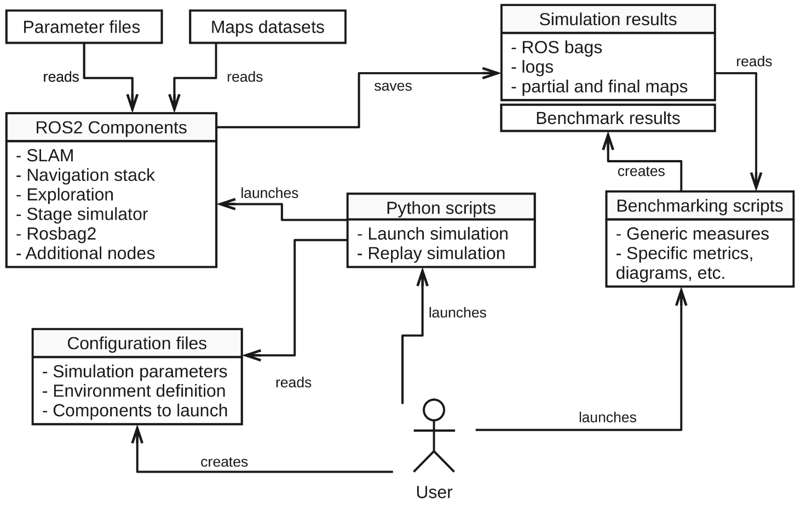
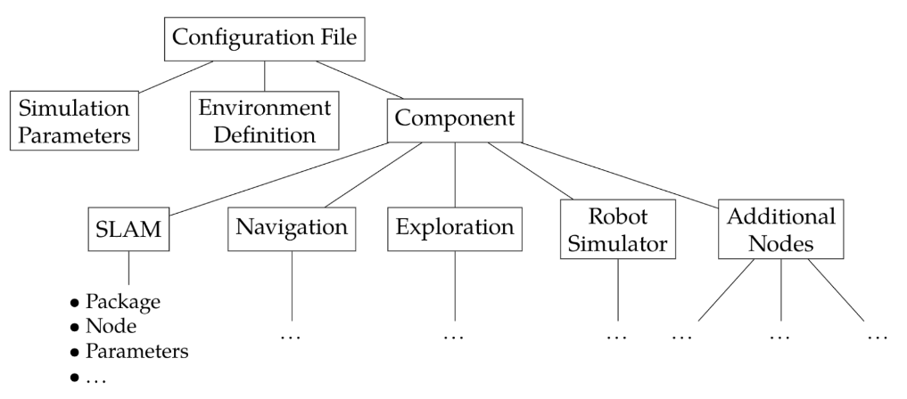

# Exploration benchmarking


## About the project

This project aims to provide a benchmarking suite for exploration algorithms of indoor robots.

Details on the project can be found in the internship report available [here](https://github.com/aislabunimi/exploration_benchmarking/tree/report) in the `report` branch.

The project can be divided in 2 parts:
- The simulation part, that launches runs according to a config file.
- The benchmarking part, that analyses the output of the runs (ros2 bags, maps, other logs...)

The following diagram illustrates the framework design:


An example of a project that uses this suite is available at [pierrebrd/exp_cov](https://github.com/pierrebrd/exp_cov).

The `ros2_simulation` folder is a ROS2 workspace that contains the packages and launch files needed to run the simulations, as well as the different configs/params and the scripts to generate them, and the `benchmark_utils` folder contains Python scripts to run the benchmarks and analyze the results.


### Simulation part

The simulation takes as an input a YAML config file that defines the different parts of the simulation and their parameters, such as the navigation stack, the exploration algorithm, the environment to simulate, the SLAM method, etc. It also launches the additional nodes that will make the benchmarking easier after the simulation.

### Benchmarking part

When a run is finished, the benchmarking script analyzes the results by looking at the generated maps and the bags containing logs and data sent on relevant topics, and can compute different metrics.

More details on those 2 parts can be found in the [Usage](#usage) section.


- [About the project](#about-the-project)
  - [Simulation part](#simulation-part)
  - [Benchmarking part](#benchmarking-part)
- [Cloning the project](#cloning-the-project)
- [Installation guide - System installation](#installation-guide---system-installation)
  - [Requirements](#requirements)
  - [Installing dependencies](#installing-dependencies)
  - [Building the package](#building-the-package)
- [Installation guide - Docker](#installation-guide---docker)
  - [Creating the Docker image](#creating-the-docker-image)
  - [Building the workspace](#building-the-workspace)
- [Usage](#usage)
  - [Simulation](#simulation)
    - [Parameters files](#parameters-files)
    - [Config files](#config-files)
    - [Launching a run](#launching-a-run)
    - [Replaying a run with a new config](#replaying-a-run-with-a-new-config)
  - [Inputs and outputs](#inputs-and-outputs)
  - [Benchmarking](#benchmarking)
    - [Benchmark metrics](#benchmark-metrics)


## Cloning the project

The project contains many submodules that need to be cloned as well:

```bash
git clone --recurse-submodules https://github.com/aislabunimi/exploration_benchmarking.git
cd exploration_benchmarking
```


## Installation guide - System installation


### Requirements

- ROS2 Humble on Ubuntu 22.04 Jammy
- A Python installation (preferably conda/miniforge)


### Installing dependencies

For the Python environment:

```bash
conda env create -f environment-minimal.yml
```
For the ros2 dependencies:

```bash
sudo apt update
sudo apt install python3-colcon-common-extensions python3-rosdep
# Stage requirements
sudo apt-get install git cmake g++ libjpeg8-dev libpng-dev libglu1-mesa-dev libltdl-dev libfltk1.1-dev 
# Install ROS2 dependencies from the ROS2 workspace
cd ros2_simulation
rosdep init
rosdep update
rosdep install --from-paths src --ignore-src -r -y
```


### Building the package

```bash
colcon build --symlink-install
source install/setup.bash
```

Note that there may be problems for the initial build if the conda environment is activated.

<!-- colcon build --symlink-install --cmake-args -DOpenGL_GL_PREFERENCE=LEGACY # Not needed anymore-->

## Installation guide - Docker

### Creating the Docker image

You can build a Docker image with the project and all its dependencies.

```bash
 docker build -t ros2humble:exploration_benchmarking .
```

In its current state, the Docker image doesn't contain the built packages, you can bind mouunt the workspace of your host machine to the container or create a docker volume. This is useful to avoid rebuilding the packages every time you start a new container, especially in development phase. You can edit the Dockerfile to build the packages directly in the image.

### Building the workspace

You can use the `docker-compose.yml` to launch a container with the bind mount:

```bash
docker compose up -d
```

And then run a bash shell in the container:

```bash
docker exec -it exploration_bench bash
```

You can the build the workspace (make sure to first delete the `build`, `install` and `log` folders in your local workspace to avoid conflicts)

```bash
colcon build --symlink-install
```


## Usage

### Simulation

#### Parameters files

The `params` folder contains the parameters file for the different parts of the simulation (parameters for nav2, the exploration algorithm, etc.), in the form of YAML files. 

#### Config files

The `configs` folder contains the configuration files for the different runs. 

Each config file is a YAML file that contains the parameters for the run, such as the environment to use, the exploration algorithm to run, the SLAM algorithm, and the parameters files that should be used for each part of the simulation (navigation, exploration, etc.).



For an example of the structure of this YAML file, see: [ros2_simulation/configs/example_gmapper.yaml](ros2_simulation/configs/example_gmapper.yaml)

The configs can be generated from a template YAML file using the `generate_configs.py` script. This script reads a template YAML file and generates multiple configs based on the parameters defined in the template.

For an example of the template YAML file, see [ros2_simulation/config_templates/example_template.yaml](ros2_simulation/config_templates/example_template.yaml). 

```bash
cd ros2_simulation
python3 generate_configs.py config_templates/example_template.yaml
```

#### Launching a run

The `singlerun.py` script is used to launch a run. It reads the config parameters from a YAML config file and launches the desired nodes to have a complete simulation, a visualization (rviz) and to save the results (rosbags, maps, etc.).

A folder for the run will be created in the `/runs` folder, it will contain the rosbag file, the maps saved periodically as well as the final map, and a copy of the config and parameters files used for the run.

The run is launched with the following commands:
```bash
cd ros2_simulation
source install/setup.bash
python3 singlerun.py configs/example_gmapper.yaml
```

#### Replaying a run with a new config

You can use a ros bag file to replay a run with a new config. This is particularly useful to try a different slam algorithm while using the exact same robot path.

An example of a replay config is [ros2_simulation/configs/replay/example_replay.yaml](ros2_simulation/configs/replay/example_replay.yaml).

A new folder will be created in the `runs` folder, with the same name as the original run + `_replay` at the end. You can launch the replay with the following command:
```bash
cd ros2_simulation
source install/setup.bash
python3 replay_from_bag.py configs/replay/example_replay.yaml ../runs/original_run_folder
```

### Inputs and outputs

To facilitate the communication between the different nodes, some standardized topics are defined

- `/cmd_vel`: robot velocity commands sent to the robot
- `/ground_truth`: ground truth robot pose (from the simulator)
- `/odom`: robot odometry (from the simulator)
- `/scan`: laser scan (LIDAR) data
- `/map`: map produced by the SLAM method (nav_msgs/msg/OccupancyGrid)
- `/tf` and `/tf_static`: transform tree frames
- `/clock`:clock topic used to synchronize nodes when using simulation time to speed up the simulation
- `/goal_sent`: goals sent by the exploration algorithm to the navigation stack (for logging)
- `/goal_reached`: goals reached (or final stop) reported by the exploration algorithm (for logging)
- `/explore/resume`: std_msgs/msg/Bool to pause (False) or resume (True) exploration

Regarding the transform tree, the `base_link`, `odom` and `map` frames are used for the robot's estimated position by the SLAM method


### Benchmarking

After the simulation is finished, a benchmarking script analyze the results (rosbags, maps, etc.) and returns the results according to defined metrics. 

The benchmarking script `benchmark.py` is a simple Python script, not a ROS2 node. Launch it in a terminal:

```bash
python3 benchmark.py relative/path/to/run/folder
```

#### Benchmark metrics

The benchmarking script uses evo to compute APE (Absolute Pose Error) and RPE (Relative Pose Error) metrics.

Some other basic metrics are implemented, with the help of several additional nodes created to improve the benchmarking process.

Possible other metrics that are not implemented yet:
- Time to obtain a complete map
- Time to obtain a sufficiently complete map (e.g. using a criterion similar to the one presented [here](https://aislabunimi.github.io/explore-stop/))
- Other ideas: difference with ground truth (deformation cost?), back and forth movements, performance in cluttered environments, multirobot exploration, etc.

**The "benchmarking" part of the project is not fully implemented, because it was not really useful for the other projects that used this suite.**